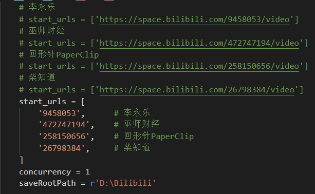

# BiliBiliDownloader

BiliBili 多 UP 主，批量视频下载。不支持登录（想下的没办法再说 [doge]）。

## 目的

收藏 UP 主的视频，方便在家离线观看，也提前为娃整理知识库。

## Why ruia？

对比了 [scrapy](https://github.com/scrapy/scrapy) 以及 [ruia](https://github.com/howie6879/ruia) ，后者的 Items 的实现更加优雅，性能没对比，主要没啥子需求，能挂机，写的快就行。[doge]

## Feature

* 下载某 UP 主所有视频
* 一次下载多个 UP 主的所有视频
* 自动根据 UP 主，为文件夹单位存放视频
* 不会重复下载（you-get 搞定的下载，所以赖得写日期过滤逻辑，除非 UP 改了 video 的描述 [doge]）
* 下载弹幕（you-get 自动下载的 *.cmt.xml 文件，其实也不是很需要，又不能互动 [doge]）

## Update

* 2020年3月29日，务必更新 ruia 、ruia-pyppeteer、you-get 到最新；
* 2020年2月6日，重构，加强异常处理，spider 可以并发，downloader 依然是单线程；
* 2020年2月4日，初版；

## How

### 安装依赖

以下是 Pipfile 文件，使用 pipenv 安装。建议保持最新。

`[[source]]`
`name = "pypi"`
`url = "https://pypi.tuna.tsinghua.edu.cn/simple"`
`verify_ssl = true`

`[dev-packages]`

`[packages]`
`ruia-pyppeteer = "*"
fake-useragent = "*"`
`ruia = "*"
pretty-errors = "*"`
`you-get = "*"
requests = "*"`
`beautifulsoup4 = "*"`

`[requires]`
`python_version = "3.6"`

pipfile 没有放进来的原因是 pipenv 创建的是一个大目录的虚拟环境，本项目仅仅是其中一个，所以 pipfile 不在其中。手动添加下。

### 入口点

参考 Main.py 。

目前只支持 <https://space.bilibili.com/XXXXX/video> 页面下的所有视频的下载。

PS：番剧什么的没有需求，以后可能会实现。playlist 也没实现，暂无需求。

## 已知问题

如果发现下载不了（注意看粗体）：

1. 很可能是爬虫解析页面的逻辑失效了；
2. 有可能是 you-get 下载失效了，自己更新下 you-get 的执行文件；
3. you-get 不支持多线程，有推荐更好的视频下载器更佳；
4. *.flv 文件格式下载速度贼慢，介个解决不了哈；

so，提交 issues 记得发日志哈。程序运行过一次后，会新建一个 Logs 文件夹，在根目录，每次一个文件。

## Base On

* [ruia](https://github.com/howie6879/ruia)
* [ruia-pyppeteer](https://github.com/python-ruia/ruia-pyppeteer) 
* [you-get](https://github.com/soimort/you-get)
