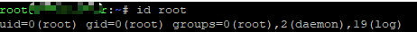

[TOC]

# BiliBiliDownloader

BiliBili 多 UP 主，批量视频下载。不支持登录（想下的没办法再说 [doge]）。

注意，本项目大方向不再更新，已经切换到新的项目中继续开发。[RSSDownloader](https://github.com/allanpk716/RSSDownloader)，详细请看对应项目的 ReadMe。

## 目的

收藏 UP 主的视频，方便在家离线观看，也提前为娃整理知识库。

## Why ruia？

对比了 [scrapy](https://github.com/scrapy/scrapy) 以及 [ruia](https://github.com/howie6879/ruia) ，后者的 Items 的实现更加优雅，性能没对比，主要没啥子需求，能挂机，写的快就行。[doge]

## Feature

* 下载某 UP 主所有视频
* 一次下载多个 UP 主的所有视频
* 自动根据 UP 主，为文件夹单位存放视频
* 不会重复下载（you-get 搞定的下载，所以赖得写日期过滤逻辑，除非 UP 改了 video 的描述 [doge]）
* 下载弹幕（you-get 自动下载的 *.cmt.xml 文件，其实也不是很需要，又不能互动 [doge]）
* 支持 Docker

## Update

* 2020年6月5日，支持 Docker（可用丢群晖跑，不用开 PC 了），修复重复下载的问题（页面爬取的日期与之前爬的日期-1天致判断未下载，这什么梗）；
* 2020年3月29日，新增 BV 转 AV 逻辑。感谢，知乎 [mcfx](https://www.zhihu.com/question/381784377/answer/1099438784) 提供代码，更新 ruia 、ruia-pyppeteer、you-get 到最新；
* 2020年2月6日，重构，加强异常处理，spider 可以并发，downloader 依然是单线程；
* 2020年2月4日，初版；

## How

### 安装依赖

有提供了两个文件

* Pipfile，lock 的文件没有提供是因为实在的网络问题 lock 不上，都是 --skip-lock 来用的 [doge]
* requirements.txt，这个是根据 pipevn 导出的，docker build 基于这个

如果想要用最新的组件，那么就是前者，稳定性未知。

如果只想要稳定可用的，那么就是后者，毕竟具体了 import 的模块

### 配置文件

这里需要设置两个配置文件，默认在项目组没有直接包含，需要从以下文件去除 .sample 后缀名来使用，丢软件根目录下。

项目中提供了两个示例：

* config.ini.sample
* DownloadList.txt.sample，务必保证是 **UTF-8** 的编码，不然后面都会出错。

记得，使用的时候，也放在本程序的根目录下，且去除 .sample 后缀名来使用。

#### fake agent

有可能无法获取 fake agent 的数据，https://fake-useragent.herokuapp.com/browsers/0.1.11

后面的代码都会使用本地缓存。

### 如何启动运行

有两种方式运行，根据自己的情况选择。

目前只支持 <https://space.bilibili.com/XXXXX/video> 页面下的所有视频的下载。

PS：番剧什么的没有需求，以后可能会实现。playlist 也没实现，暂无需求。


#### 1. 直接运行，使用配置

这里举例，Windows 情况。 config.ini  修改为

```ini
[DownloadConfig]
; 这个是下载视频的存储根目录，会根据视频作者自动新建子目录
saveRootPath=Z:\科普
; 并发线程，仅在爬取视频页面有效，下载还是单线程，有疑问看 ReadMe.md 的<已知问题>
concurrency=3
```

DownloadList.txt 修改为你想要下载的 Uper 主。

注意这里的格式：期望的Uper主名称 # Uper主的频道ID，且不要添加多余内容，没做处理会崩溃的哈

举例，想要关注下载，李永乐老师，他的页面是 https://space.bilibili.com/9458053/video，那么就会有如下的内容，以此类推。

```
李永乐 # 9458053
巫师财经 # 472747194
回形针PaperClip # 258150656
柴知道 # 26798384
吟游诗人基德 # 510856133
讲解员河森堡 # 483884702
```

然后找到 Main.py 运行即可。

#### 2. 使用 docker 镜像运行，使用配置

这里分了两个 dockerfile，因为会在家自己 build，指向的是私有的 registry。

后续的配置主要就是映射 volume，因为是使用 portainer 来操作 docker 容器的所以就截图了


这里需要设置4个点，其实具体到配置文件就是两个，内容如下

config.ini 的内容如下，注意，这里的下载目标的目录**必须**得是 /app/download

```ini
[DownloadConfig]
saveRootPath=/app/download
concurrency=3
; 重复的次数，-1 是一致循环，如果是 docker 挂机，那么建议是 -1
repeatTimes=1
; 秒为单位
delay=18000
```

DownloadList.txt 内容参考上面的。

剩下就是**权限**问题（Docker Build 的时候写固定了，因为群晖是 root 开启的 Docker），这里取巧给的是 root 的权限，这样与 docker run 的所有者权限一致，详情见 dockerfile。相应的你的下载目标文件夹，也得是 root 有权限，不然下载的时候没有权限。

dockerfile 中的权限设置部分：

```dockerfile
RUN chown -R 0 /app \
    # 提前下载 chrome
    && python3 dockerbuild.py
```

如何查看，你的 docker 是用什么账号运行的？

```bash
ps aux | grep docker
```

那么我这里是 root


然后查看他的 UID GID

```bash
id root
```

结果如下



那么你的 dockerfile 的 RUN chown -R 就填写 UID。

### 入口点

参考 Main.py 。

## 已知问题

如果发现下载不了（注意看粗体）：

1. ~~由于 pyppeteer 不正确结束会出现大量的 chrome 僵尸进程，所以，现在启动的瞬间会去 kill Chrome 的进程，你浏览器被关闭就这原因；~~  注释掉了；
2. 网络不好，导致页面读取不全，引起异常；
3. 很可能是爬虫解析页面的逻辑失效了；
4. 有可能是 you-get 下载失效了，自己更新下 you-get 的执行文件；
5. you-get 不支持多线程，有推荐更好的视频下载器更佳；
6. *.flv 文件格式下载速度贼慢，介个解决不了哈；
7. 务必保持 Base On 列表几个支持库最新，因为有可能解决了他们自己的 BUG···

so，提交 issues 记得发日志哈。程序运行过一次后，会新建一个 Logs 文件夹，在根目录，每次一个文件。

## Base On

* [ruia](https://github.com/howie6879/ruia)
* [ruia-pyppeteer](https://github.com/python-ruia/ruia-pyppeteer) 
* [you-get](https://github.com/soimort/you-get)
